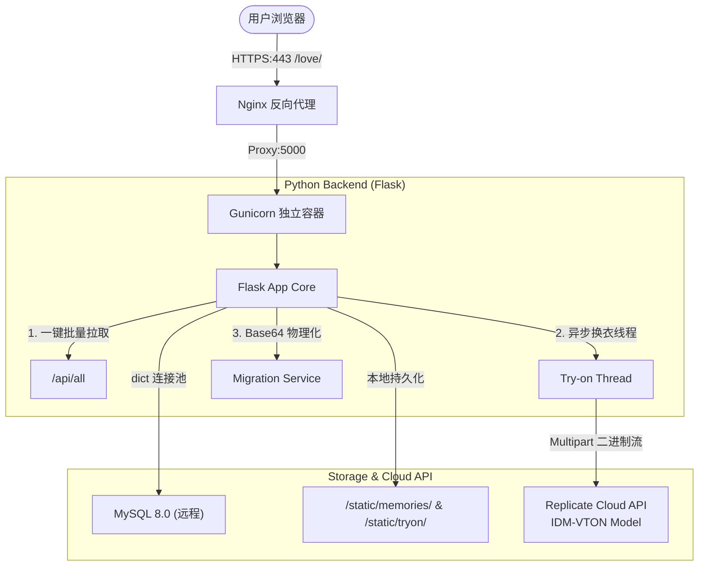

# 💖 Love Memory — 智能情侣纪念册与 AI 换装魔镜

<p align="center">
  
</p>

<h3 align="center">Love Memory</h3>

<p align="center">
  一个为情侣量身定制的极致浪漫纪念空间，完美融合了日常温暖记录与前沿的 AI 虚拟试衣技术。
</p>

<p align="center">
  <a href="#-核心功能">核心功能</a> •
  <a href="#-技术架构">技术架构</a> •
  <a href="#-技术亮点与极致优化">极致优化</a> •
  <a href="#-本地快速开始">快速开始</a> •
  <a href="#-生产部署">部署指南</a>
</p>

---

## 🌟 项目简介

**Love Memory（恋爱纪念）** 不仅仅是一个记录爱意的纪念册，更是一个充满交互温度的数字爱巢。它采用现代轻奢的**毛玻璃拟物化设计 (Glassmorphism)** 界面，不仅具备**恋爱计时**、**双人留言**、**纪念生日锁悄悄话**和**流媒体记忆墙**等情侣必备功能，更创新性地接入了基于 **IDM-VTON** 架构的 **AI 换装魔镜** 模块。

在这里，科技不再冰冷，而是成为记录、重温与创造美好瞬间的温暖介质。

---

## 💖 核心功能

### 1. ⏳ 恋爱倒计时 (Love Timer)
* **动态流逝**：首屏高亮动态展示双方在一起的累计天数、小时、分钟、秒，爱意微秒级跳动。
* **极速加载**：首屏背景图异步智能拉取，提供完美的秒开体验与极致的视觉第一印象。

### 2. 💬 浪漫双人留言板 (BBS)
* **实时倾诉**：轻量级留言发布与物理删除，毫秒级即时渲染。
* **仪式感统计**：实时显示留言总条数徽章，记录你们说过的每一句悄悄话。

### 3. 🔒 私密信箱 (Secret Box)
* **专属物理加密**：以对方的生日（4 位数字）作为进入凭证，打造只属于两个人的隐秘空间。
* **自动锁定机制**：支持一键快速上锁，保证隐私安全。

### 4. 📸 共同记忆墙 (Memory Wall & Timeline)
* **多媒体支持**：不仅支持精美相片，还完美支持视频及音频等多媒体记忆上传。
* **时光轴渲染**：按照发生日期降序排版的瀑布流时间轴，卡片式记录当时的心情与感受。

### 5. 🪄 AI 换装魔镜 (AI Try-on Magic Mirror) — *Core Highlight!*
* **尖端 AI 赋能**：集成前沿的 **IDM-VTON** 虚拟试衣大模型，完美融合人物日常照与新装衣服图。
* **智能部位分类**：支持上装 (upper_body)、下装 (lower_body) 及连衣裙 (dresses) 三大试衣维度，并支持补充描述词引导。
* **极致性能响应**：重构的全链路异步生成逻辑，省去了漫长的等待，生成图一键下载保存。

---

## 🛠️ 技术架构

系统采用轻量高效的前后端分离架构，通过 Nginx 进行反向代理与 HTTPS 安全分发，保证了系统的高性能与高可用度。



---

## 🚀 技术亮点与极致优化

在性能和稳定性上，本项目进行了多维度的深层次重构与打磨：

### 1. ⚡ 全链路 AI 换装加速优化
* **Multipart 二进制免编码上传**：后台线程直接读取前端上传的图片二进制流并发送给 API，**免去 Base64 编码带来的 33% 体积膨胀**，大幅降低带宽占用与提交延迟。
* **非阻塞多线程分发**：主线程在接收任务后立即返回 `task_id (HTTP 202 Accepted)`，所有繁重的 AI 调用与轮询均在全局守护线程池中异步执行。
* **智能指数退避轮询**：轮询机制从固定的 3s 优化为**前 30s 内每 2s 极速查询一次，随后以指数级退避（最高 6s）**，完美平衡“快速获知结果”与“防止 API 请求过载”。
* **双阶段渲染加速**：模型图片一旦在 Replicate 端生成完毕，**立刻把云端 CDN 链接推给前端渲染，随后在后台静默下载回服务器本地保存并覆写状态**，彻底免去用户等待大文件下载的感知时延。

### 2. 🗄️ 数据库连接池化 (PooledDB)
* 放弃了频繁握手的单次 TCP 连接，基于 `dbutils.pooled_db` 构建了高可用的 MySQL 数据库连接池。
* 支持预建空闲连接、心跳检测（Ping存活）以及阻塞等待，保证高频写入时数据库的低延迟。

### 3. 🚀 一键批量拉取接口 (`/api/all`)
* 优化了前端初始化时的多次网络往返 (RTT)，设计了批量拉取路由。
* 只需一次 HTTP 请求即可同时拿到留言、悄悄话、记忆墙三大板块的全部数据，页面首屏加载时间缩短 60% 以上。

### 4. 🧹 静态存储平滑迁移 (Base64 Migration)
* 后端内置自动化迁移引擎：系统启动时，自动扫描数据库中早期的 Base64 冗余图片数据，解码为物理文件保存至本地 `/static/memories/` 并自动重构数据库为相对路径。
* 大幅释放了数据库空间，消除了大字段对数据库查询带来的性能拖累。

### 5. 🔒 文件锁级并发控制 (`fcntl`)
* 使用 Python 标准库 `fcntl` 文件锁来保护任务状态 JSON 文件（`tryon_tasks.json`）。
* 保证了在多 Worker / 多进程部署环境下（如 Gunicorn），并发读写任务状态时的线程安全与数据一致性。

---

## 📦 本地快速开始

### 1. 克隆仓库
```bash
git clone https://github.com/yourusername/love_memory.git
cd love_memory
```

### 2. 配置 Python 虚拟环境
```bash
# 创建虚拟环境
python -m venv .venv

# 激活虚拟环境 (Windows)
.venv\Scripts\activate

# 安装依赖
pip install -r requirements.txt
```

### 3. 配置本地环境变量 (.env)

项目已内置无外部依赖的环境变量加载引擎。请复制根目录下的 `.env.example` 并重命名为 `.env`，然后填写您本地的数据库连接参数及 Replicate API 凭证：

```bash
# 复制模板文件
cp .env.example .env
```

随后打开 `.env` 填写真实参数即可：
```ini
# 数据库配置
DB_HOST=your_database_host
DB_PORT=3306
DB_USER=your_database_user
DB_PASSWORD=your_database_password
DB_NAME=love_db

# 站点域名
SITE_BASE_URL=http://localhost:5000

# Replicate 令牌 (换镜助手必需)
REPLICATE_API_TOKEN=your_replicate_token_here
```

> [!IMPORTANT]
> **本地创建的 `.env` 文件包含真实的数据库连接凭证，已在 `.gitignore` 中被安全过滤，切勿上传提交至 GitHub 公开仓库！**

### 4. 运行开发服务器
```bash
python app.py
```
运行成功后，在浏览器访问 `http://127.0.0.1:5000` 即可开启专属恋爱纪念空间。

---

## 🌐 生产部署

生产环境下建议使用 **Nginx** 反向代理与 **Gunicorn** 独立伺服。

### 1. Gunicorn 部署
```bash
# 在项目目录下使用虚拟环境内的 gunicorn 以后台守护进程启动
nohup .venv/bin/gunicorn -w 4 -b 127.0.0.1:5000 app:app > gunicorn.log 2>&1 &
```

### 2. Nginx 配置示例
```nginx
server {
    listen 443 ssl;
    server_name yourdomain.com;

    ssl_certificate /path/to/fullchain.pem;
    ssl_certificate_key /path/to/privkey.pem;

    # 静态资源与主站反向代理
    location /love/ {
        proxy_pass http://127.0.0.1:5000/;
        proxy_set_header Host $host;
        proxy_set_header X-Real-IP $remote_addr;
        proxy_set_header X-Forwarded-For $proxy_add_x_forwarded_for;
        proxy_set_header X-Forwarded-Proto $scheme;

        # 允许上传大图 (用于换装原图)
        client_max_body_size 20m;
    }
}
```

---

## 🎨 视觉预览

| ⏳ 恋爱倒计时与主页 | 💬 双人留言板 |
| :---: | :---: |
| *毛玻璃拟物风，精选思源宋体与 Dancing Script 艺术字体，营造温馨而高雅的浪漫第一眼。* | *轻量化气泡流设计，即时反馈，带留言总条数徽章实时更新。* |

| 🔒 生日密码私密信箱 | 📸 共同记忆时光轴 |
| :---: | :---: |
| *以 4 位生日锁住温柔。在解锁前悄悄话全程安全隔离，保障双方的小小天地。* | *优雅的瀑布流时间轴，记录你们的照片、视频与当时的心境，让回忆立体生动。* |

| 🪄 AI 换装魔镜 | 🖼️ 极速照片灯箱 |
| :---: | :---: |
| *搭载 IDM-VTON 大模型，支持上装、下装、连衣裙换装，极佳的异步多线程加载进度反馈。* | *精心重构的视频/图像灯箱，支持大图极速预览及原图下载。* |

> [!TIP]
> **设计感十足**：为了实现最佳的视觉观感，项目未采用任何模板化的 AI 渐变色或通用 CSS 框架，全站使用**纯手写 Vanilla CSS** 精雕细琢而成，保证了无与伦比的流畅动画与高级质感。

---

## 📄 开源协议

本项目基于 [MIT License](LICENSE) 协议开源。欢迎在此基础上定制专属于你们的浪漫小屋。

---

<p align="center">
  由 <a href="https://github.com/yourusername">YourName</a> 倾心设计与开发。愿天下有情人终成眷属。💕
</p>
